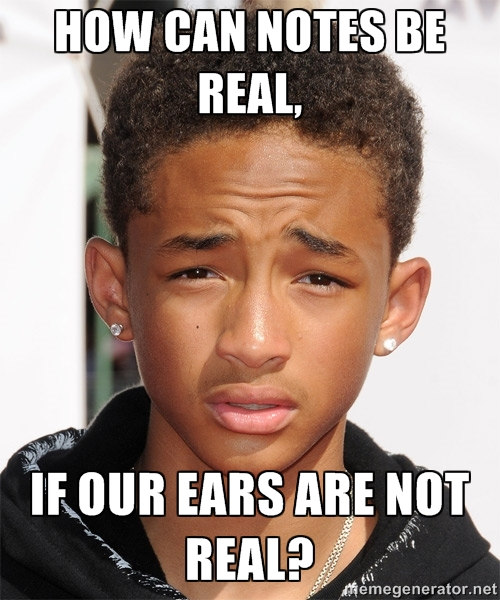
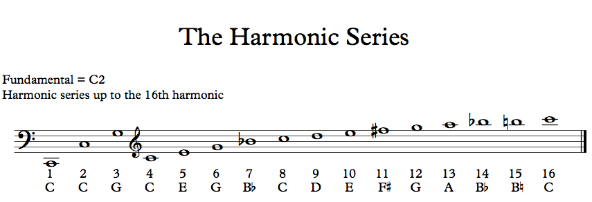
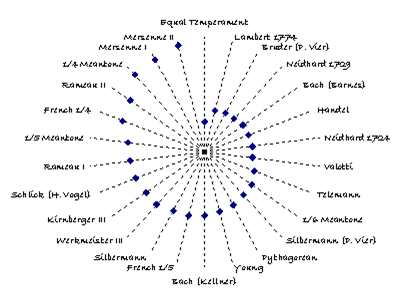
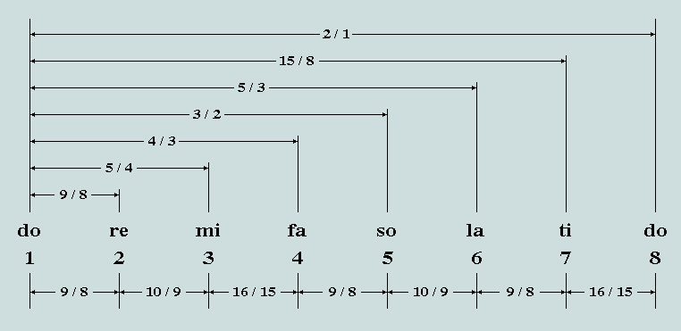
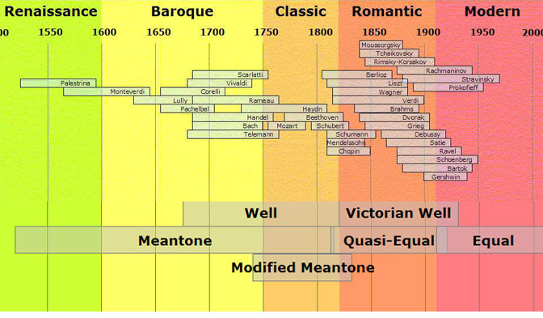

### - Mahidhar C

> "Music is not the notes, it's the distance between the notes"

-- Some random dude.

# Visual Spectrum

# "Disadvantages"

* Limited to just one "octave"
* No simultaneous perception of individual and multiple sensory elements

### But at the end of the day I can't believe I'm stupid enough 
### to compare my eyes to my ears. :P

Both audio and visual spectrums are continuous.

We need to extract discrete points to make it useful for us.

## Colors in the visual spectrum for art.

## Notes in the audio spectrum for music.

Buuuut... how do you figure out which points to use?

I probably sound high right now.

How do we choose which frequencies can be used as notes?

How do we figure out where to place the frets on a guitar?

How do we figure out where to drill the finger holes on a flute?

## Answer: Natural harmonics and temperment!

# Natural harmonics

# Temperment

# Pythagoras Tuning

# Just Tuning

# Bach

# WARNING: MATH!!

# Summary

# Thank You!

## Questions?

### mahidhar.c@gmail.com
### mahidharc.github.io
